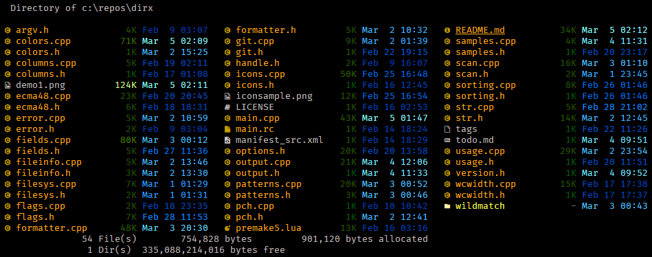
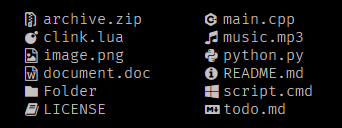

# DirX - the `dir` command, extended

Displays a list of file and subdirectories in a directory.



The demo image above was produced using the following:

```batch
set DIRX_COLORS=di=1;33:ro=32:ro ex=1;32:ex=1:co=35:hi=38;2;204;64;64:sy=38;2;204;64;64:*.zip=36:da=38;5;33:sc=33:bu=33;4
set DIRX_COLORS=%DIRX_COLORS%:sn=38;5;244:nt=38;2;239;65;54:ng=38;2;252;176;64:nm=38;2;240;230;50:nk=38;2;142;198;64:nb=38;2;1;148;68:sb=38;5;240

set DIRXCMD=--icons

doskey d=dirx.exe --compact -Qv -whjv -Z -a- -f "F19 S D T? G?" $*

d -k
```

## Usage

```
DIRX [options] [drive:][path][filename]
```

DirX is designed so that most command line options from the CMD `dir` command work the same, to make DirX mostly a drop-in replacement for `dir`.

### Arguments

```
  [drive:][path][filename]
```

Specifies drive, directory, and/or files to list.  Use as many arguments as desired (or none, in which case the current directory is assumed).

Prefix the filename part with :: to use a [regular expression](#regular-expressions).

### Options

<table>
<tr><td><code>-?</code>, <code>--help</code></td><td>Display the help text.</td></tr>
<tr><td><code>-? colors</code></td><td>Display help text on <a href="#colors">color coding the file list</a>.</td></tr>
<tr><td><code>-? colorsamples</code></td><td>Display samples of the supported color codes.</td></tr>
<tr><td><code>-? defaultcolors</code></td><td>Print the default DIRX_COLORS string.</td></tr>
<tr><td><code>-? icons</code></td><td>Display help text on <a href="#icons">file icons and Nerd Fonts</a>.</td></tr>
<tr><td><code>-? pictures</code></td><td>Display help text on <a href="#format-pictures">format pictures</a>.</td></tr>
<tr><td><code>-? printallicons</code></td><td>Print a list of all icons.</td></tr>
<tr><td><code>-? regex</code></td><td>Display help text on <a href="#regular-expressions">regular expression syntax</a>.</td></tr>
<tr><td><code>-V</code>, <code>--version</code></td><td>Display version information.</td></tr>
</table>

#### Display Options

<table>
<tr><td><code>-1</code></td><td>Display one column per line.</td></tr>
<tr><td><code>-2</code></td><td>Display two columns per line (more in wide consoles).</td></tr>
<tr><td><code>-4</code></td><td>Display four columns per line (more in wide consoles).</td></tr>
<tr><td><code>-a</code>, <code>--all</code></td><td>Display all files (include hidden and system files).</td></tr>
<tr><td><code>-b</code>, <code>--bare</code></td><td>Bare mode; only display names, no header/detail/etc.</td></tr>
<tr><td><code>-c</code>, <code>--color</code></td><td>Display with colors (see <a href="#colors">Colors</a> for more info).</td></tr>
<tr><td><code>-g</code>, <code>--git</code></td><td>List each file's git status.</td></tr>
<tr><td><code>-gg</code>, <code>--git-repos</code></td><td>List status of git repo roots and each file's git status (or <code>--git-repos-no-status</code> to omit file status).</td></tr>
<tr><td><code>-G</code>, <code>--grid</code></td><td>Synonym for <code>--wide</code>.</td></tr>
<tr><td><code>-i</code>, <code>--icons[=WHEN]</code></td><td>Display file icons (use <a href="#icons">Icons</a> for more info).<br/><em>WHEN</em> can be <code>always</code>, <code>auto</code>, <code>never</code> (default).</td></tr>
<tr><td><code>-k</code>, <code>--color-scale[=FIELD]</code></td><td>Highlight levels of certain fields distinctly.<br/><em>FIELD</em> can be <code>all</code>, <code>age</code>, <code>size</code>, <code>none</code> (default).</td></tr>
<tr><td><code>-l</code>, <code>--long</code></td><td>Long mode; display one file per line, plus attributes.</td></tr>
<tr><td><code>-n</code>, <code>--normal</code></td><td>Force normal list format even on FAT volumes.</td></tr>
<tr><td><code>-Q</code>, <code>--quash[=TYPES]</code></td><td>Quash types of output.  Use <code>-Q</code> by itself as a synonym for <code>-Q+v+h+s</code>.<br/><em>TYPES</em> can be:
    <ul>
    <li><code>v</code> Suppress the volume information.</li>
    <li><code>h</code> Suppress the header.</li>
    <li><code>s</code> Suppress the summary.</li>
    <li><code>-</code> Prefix to suppress next type (the default).</li>
    <li><code>+</code> Prefix to un-suppress next type.</li>
    </ul>
    </td></tr>
<tr><td><code>-p</code>, <code>--paginate</code></td><td>Pause after each screen full of information.</td></tr>
<tr><td><code>-R</code></td><td>Synonym for <code>--recurse</code>.</td></tr>
<tr><td><code>-s</code>, <code>--recurse</code></td><td>Subdirectories; recursively display files in specified directory and all subdirectories.</td></tr>
<tr><td><code>-u</code>, <code>--usage</code></td><td>Display directory size usage data.</td></tr>
<tr><td><code>-v</code>, <code>--vertical</code></td><td>Sort columns vertically.</td></tr>
<tr><td><code>--horizontal</code></td><td>Sort columns horizontally (the default).</td></tr>
<tr><td><code>-w</code>, <code>--wide</code></td><td>Wide mode; show as many columns as fit.</td></tr>
<tr><td><code>-z</code>, <code>--fat</code></td><td>Force FAT list format even on non-FAT volumes.</td></tr>
<tr><td><code>--color-scale-mode=MODE</code></td><td>Mode for <code>--color-scale</code> (see <a href="#colors">Colors</a> for more info).<br/><em>MODE</em> can be <code>fixed</code>, <code>gradient</code> (default).</td></tr>
<tr><td><code>--hyperlinks</code></td><td>Display entries as hyperlinks.</td></tr>
<tr><td><code>--tree</code></td><td>Tree mode; recursively display files and directories in a tree layout.</td></tr>
</table>

#### Filtering and Sorting Options

<table>
<tr><td><code>-a[...]</code></td><td>Display files with the specified attributes.  If attributes are combined, all attributes must match (<code>-arhs</code> only lists files with all three attributes set).  The <code>-</code> prefix excludes files with that attribute (<code>-arh-s</code> lists files that are read-only and hidden and not system).  The <code>+</code> prefix includes files that have any of the + attributes set (<code>-ar+h+s</code> lists files that are read-only and are hidden or system).
    <ul>
    <li><code>r</code> Read-only files</li>
    <li><code>h</code> Hidden files</li>
    <li><code>s</code> System files</li>
    <li><code>a</code> Ready for archiving</li>
    <li><code>d</code> Directories</li>
    <li><code>i</code> Not content indexed files</li>
    <li><code>j</code> Reparse points (mnemonic for junction)</li>
    <li><code>l</code> Reparse points (mnemonic for link)</li>
    <li><code>e</code> Encrypted files</li>
    <li><code>t</code> Temporary files</li>
    <li><code>p</code> Sparse files</li>
    <li><code>c</code> Compressed files</li>
    <li><code>o</code> Offline files</li>
    <li><code>+</code> Prefix meaning any</li>
    <li><code>-</code> Prefix meaning not</li>
    </ul></td></tr>
<tr><td><code>-A</code>, <code>--almost-all</code></td><td>Display all files, except hide . and .. directories.</td></tr>
<tr><td><code>-h</code></td><td>Hide . and .. directories.</td></tr>
<tr><td><code>-I</code>, <code>--ignore-glob=GLOB</code></td><td>Glob patterns of files to ignore; the syntax is the same as in <code>.gitignore</code>.  The <code>/</code> is used as the directory separator.  An optional <code>!</code> prefix negates a pattern; any matching file excluded by a previous pattern will be included again.  Multiple patterns may be specified separated by a <code>;</code> or <code>|</code> character.</td></tr>
<tr><td><code>-L</code>, <code>--levels=DEPTH</code></td><td>Limit the depth of recursion with <code>-s</code>.</td></tr>
<tr><td><code>-o[...]</code></td><td>Sort the list by the specified options:
    <ul>
    <li><code>n</code> Name [and extension if <code>e</code> omitted] (alphabetic)</li>
    <li><code>e</code> Extension (alphabetic)</li>
    <li><code>g</code> Group directories first</li>
    <li><code>d</code> Date/time (oldest first)</li>
    <li><code>s</code> Size (smallest first)</li>
    <li><code>c</code> Compression ratio</li>
    <li><code>a</code> Simple ASCII order (sort <code>10</code> before <code>2</code>)</li>
    <li><code>u</code> Unsorted</li>
    <li><code>r</code> Reverse order for all options</li>
    <li><code>-</code> Prefix to reverse order</li>
    </ul></td></tr>
<tr><td><code>-X</code>, <code>--skip=TYPES</code></td><td>Skip types during <code>-s</code>.  Use <code>-X</code> by itself as a synonym for <code>-X+d+j+r</code>.
    <ul>
    <li><code>d</code> Skip hidden directories (when used with <code>-s</code>)</li>
    <li><code>j</code> Skip junctions (when used with <code>-s</code>)</li>
    <li><code>r</code> Skip files with no alternate data streams</li>
    <li><code>-</code> Prefix to skip next type (this is the default)</li>
    <li><code>+</code> Prefix to un-skip next type</li>
    </ul></td></tr>
<tr><td><code>--git-ignore</code></td><td>Ignore files mentioned in .gitignore files.</td></tr>
<tr><td><code>--hide-dot-files</code></td><td>Hide file and directory names starting with <code>.</code> or <code>_</code>.<br/>
    Using <code>-a</code> overrides this and shows them anyway.</td></tr>
<tr><td><code>--reverse</code></td><td>Reverse the selected sort order.</td></tr>
<tr><td><code>--string-sort</code></td><td>Sort punctuation as symbols.</td></tr>
<tr><td><code>--word-sort</code></td><td>Sort punctuation as part of the word (default).</td></tr>
</table>

#### Field Options

<table>
<tr><td><code>-C</code>, <code>--ratio</code></td><td>List the compression ratio.</td></tr>
<tr><td><code>-q</code>, <code>--owner</code></td><td>List the owner of the file.</td></tr>
<tr><td><code>-r</code>, <code>--streams</code></td><td>List alternate data streams of the file.</td></tr>
<tr><td><code>-S</code>, <code>--size</code></td><td>List the file size even in multple column formats.</td></tr>
<tr><td><code>-S[acf]</code>, <code>--size=acf</code></td><td>Which size field to display or use for sorting:
    <ul>
    <li><code>a</code> Allocation size.</li>
    <li><code>c</code> Compressed size.</li>
    <li><code>f</code> File size (default).</li>
    </ul></td></tr>
<tr><td><code>-t</code>, <code>--attributes</code></td><td>List the file attributes (use the flag twice to list all attributes, e.g. <code>-tt</code>).</td></tr>
<tr><td><code>-T</code>, <code>--time</code></td><td>List the file time even in multiple column formats.</td></tr>
<tr><td><code>-T[acw]</code>, <code>--time=acw</code></td><td>Which time field to display or use for sorting:
    <ul>
    <li><code>a</code> Access time.</li>
    <li><code>c</code> Creation time.</li>
    <li><code>w</code> Write time (default).</li>
    </ul></td></tr>
<tr><td><code>-x</code>, <code>--short-names</code></td><td>Show 8.3 short file names.</td></tr>
</table>

#### Formatting Options

<table>
<tr><td><code>-,</code></td><td>Show the thousand separator in sizes (the default).</td></tr>
<tr><td><code>-f[...]</code></td><td>Use the specified format picture.  You can greatly customize how the list is display (see <a href="#pictures">Pictures</a> for more info).</td></tr>
<tr><td><code>-F</code>, <code>--full-paths</code></td><td>Show full file paths in the file name column.</td></tr>
<tr><td><code>-j</code></td><td>Justify file names in FAT list format.</td></tr>
<tr><td><code>-J</code></td><td>Justify file names in non-FAT list formats.</td></tr>
<tr><td><code>--justify[=WHEN]</td><td>Justify file names, in which list formats.  If <em>WHEN</em> is omitted, <code>always</code> is assumed.<br/><em>WHEN</em> can be <code>always</code>, <code>fat</code>, <code>normal</code>, <code>never</code> (default).</td></tr>
<tr><td><code>-SS</td><td>Show long file sizes (implies -S).  Note that some list formats limit the file size width.</td></tr>
<tr><td><code>-TT</td><td>Show long dates and times (implies -T).  Note that some list formats limit the date and time width.</td></tr>
<tr><td><code>-W, --width=COLS</td><td>Override the screen width.</td></tr>
<tr><td><code>-Y</td><td>Abbreviate dates and times (implies <code>-T</code>).</td></tr>
<tr><td><code>-Z</td><td>Abbreviate file sizes as 1K, 15M, etc (implies <code>-S</code>).</td></tr>
<tr><td><code>--bare-relative</code></td><td>When listing subdirectories recursively, print paths relative to the specified patterns instead of expanding them to fully qualified paths (implies <code>--bare</code>).</td></tr>
<tr><td><code>--classify</td><td>Print <code>\</code> by dir names and <code>@</code> by symlink names.</td></tr>
<tr><td><code>--compact</code></td><td>Use compact time style (short for <code>--time</code> and <code>--time-style=compact</code>).</td></tr>
<tr><td><code>--escape-codes[=WHEN]</td><td>For colors and hyperlinks in modern terminals.<br/><em>WHEN</em> can be <code>always</code>, <code>auto</code> (default), <code>never</code>.</td></tr>
<tr><td><code>--fit-columns</td><td>Fit more columns in <code>-w</code> mode by compacting column widths to fit their content (this is the default; use <code>--no-fit-columns</code> to disable it).</td></tr>
<tr><td><code>--lower</td><td>Show file names using lower case.</td></tr>
<tr><td><code>--mini-bytes</td><td>Show bytes in the mini size format when less than 1000.</td></tr>
<tr><td><code>--mini-decimal</td><td>Always show one decimal place in the mini size format.</td></tr>
<tr><td><code>--mini-header</td><td>Show a mini header of just the directory name above each directory listing (if more than one directory).</td></tr>
<tr><td><code>--more-colors=LIST</td><td>Add color rules in the same format as the <code>DIRX_COLORS</code> environment variable (see <a href="#colors">Colors</a> for more info).</td></tr>
<tr><td><code>--nerd-fonts=VER</td><td>Select which Nerd Fonts version to use (see <a href="#colors">Colors</a> for more info).</td></tr>
<tr><td><code>--nix</td><td>Selects default options that are similar to Unix and Linux systems.  Hides files starting with <code>.</code>, skips recursing into hidden directories, sorts vertically, displays the file list in wide mode, selects <code>compact</code> time style, shows a mini directory header above file lists, quashes volume/header/summary output, disables filename justify, shows long file names, shows <code>-</code> as size for dirs, and suppresses thousands separators.</td></tr>
<tr><td><code>--pad-icons=SPACES</code></td><td>Number of spaces to print after an icon.</td></tr>
<tr><td><code>--relative</code></td><td>Use relative time style (short for <code>--time</code> and <code>--time-style=relative</code>).</td></tr>
<tr><td><code>--size-style=STYLE</code></td><td>Which size format to use for display by default when not overridden by other format options.<br/><em>STYLE</em> can be
    <code>mini</code>, <code>short</code>, <code>normal</code> (default).</td></tr>
<tr><td><code>--time-style=STYLE</code></td><td>Which time format to use for display by default when not overridden by other format options.<br/><em>STYLE</em> can be
    <code>locale</code> (default), <code>mini</code>, <code>compact</code>, <code>short</code>, <code>normal</code>, <code>full</code>, <code>iso</code>, <code>long-iso</code>, <code>relative</code>.</td></tr>
<tr><td><code>--truncate-char=HEX</td><td>Set the truncation character for file names that don't fit in the allotted space.  Specify a Unicode character value in hexadecimal (e.g. 2192 is a right-pointing arrow <code>&#x2192;</code>, 25b8 is a right-pointing triangle <code>&#x25b8;</code>).  Or specify 002e to use <code>..</code> (two periods).</td></tr>
<tr><td><code>--utf8</td><td>When output is redirected, produce UTF8 output instead of using the system codepage.</td></tr>
</table>

Long options that can be used without an argument also accept a `no-` prefix to disable them.  For example, the `--fit-columns` option is enabled by default, and using `--no-fit-columns` disables it.

#### Environment Variables

Set `DIRXCMD` to preset options to use by default.  To override any on/off option, add a hyphen (`-k-` overrides `-k`).  Or for long options insert `no-` (`--no-attributes` overrides `--attributes`).  For interop compatibility with the CMD `dir` command, slash options may also be used, for example `/w`.  Unlike the CMD `dir` command, use `/w-` instead of `/-w` to override the slash option.

Set `DIRX_COLORS` to specify colors to use in the file list display.  Use `-? colors` or see [Colors](#colors) for more info on color coding rules.

## Colors

Set the `DIRX_COLORS` environment variable to control how files and directories are colored.  The format is:

```
  condition=color: condition=color: ...
```

Any number of pairs of conditions and colors can be given.  Use colons to separate them and build a list of many coloring rules.

The list can start with the special keyword `reset` to clear all default color rules and any rules that may have been provided in the LS_COLORS environment variable.

#### Examples:

```
set DIRX_COLORS=sc=93:bu=93;4:cm=38;5;172
```
- Source code files in yellow.
- Build system files in yellow with underline.
- Compiled files in orange.

```
set DIRX_COLORS=ro=32:ex=1:ro ex=1;31:ln=target
```
- Read-only files in green.
- Executable files in bright white.
- Files that are both read-only and executable in bright green.
- Symlinks colored by the type of the target of the symlink.

### CONDITION syntax

Each condition can specify two-letter types, or patterns to match.  If more than one are specified then all of them must match, and rules with multiple types and/or patterns are evaluated in the order they are listed.

#### Negation:

- `not` negates the next type or pattern (`not hi` means not hidden).
- `!` negates the next type or pattern (`!hi` means not hidden).

#### File attribute names:

- `ar` Archive attribute (ready for archiving).
- `cT` Compressed attribute.
- `di` Directory.
- `en` Encrypted attribute.
- `fi` File.
- `hi` Hidden.
- `ln` Symlink.
- `NI` Not content indexed attribute.
- `of` Offline attribute.
- `or` Orphaned symlink.
- `ro` Read-only attribute.
- `SP` Sparse file.
- `sy` System attribute.
- `tT` Temporary attribute.

Setting `ro` by itself applies only to files, not directories.<br/>
Setting `ln=target` or `ln=:` colors symlinks by the type of the target of the symlink.<br/>
Setting `hi=50%` colors hidden files and directories at 50% luminance of whatever color the file or directory would have had.  Specify any percentage between 30% and 90%.  This can only be used with the `hi` attribute name.

#### File groups:

- `ex` Executable files.
- `do` Document files.
- `im` Image files.
- `vi` Video files.
- `mu` Music files.
- `lo` Lossless music files.
- `cR` Compressed type files (like *.zip).
- `tX` Temporary type files (like *.tmp).
- `cm` Compiled files.
- `bu` Build files (like *.sln).
- `sc` Source code (like *.cpp).
- `cr` Cryptography files.

#### Special groups:

- `co` Compressed; includes both `cR` and `cT`.
- `tm` Temporary; includes both `tX` and `tT`.

#### Color element names:

These let you define colors of various elements of the output.

- `sn` File size (sets nb, nk, nm, ng and nt).
- `nb` File size if less than 1 KB.
- `nk` File size if between 1 KB and 1 MB.
- `nm` File size if between 1 MB and 1 GB.
- `ng` File size if between 1 GB and 1 TB.
- `nt` File size if 1 TB or greater.
- `sb` Units of a file’s size (sets ub, uk, um, ug and ut).
- `ub` Units of a file’s size if less than 1 KB.
- `uk` Units of a file’s size if between 1 KB and 1 MB.
- `um` Units of a file’s size if between 1 MB and 1 GB.
- `ug` Units of a file’s size if between 1 GB and 1 TB.
- `ut` Units of a file’s size if 1 TB or greater.
- `da` File date and time.
- `cF` File compression ratio.
- `oF` File owner.
- `ga` New file in git.
- `gm` Modified file in git.
- `gd` Deleted file in git.
- `gv` Renamed file in git.
- `gt` Type change in git.
- `gi` Ignored file in git.
- `gc` Unmerged file in git (conflicted).
- `Gm` Git repo main branch name.
- `Go` Git repo other branch name.
- `Gc` Git repo is clean.
- `Gd` Git repo is dirty.
- `GO` Overlay style for dirty git repo.
- `xx` Punctuation (for example _ in the attributes field).
- `hM` The directory name with --mini-header.
- `ur` The read-only attribute letter in the attributes field.
- `su` The hidden attribute letter in the attributes field.
- `sf` The system attribute letter in the attributes field.
- `pi` The junction attribute letter in the attributes field.
- `lp` The symlink path when showing symlink targets.
- `bO` Overlay style for broken symlink paths when showing symlink targets.

The color element names above cannot be combined with types or patterns; they're for setting general colors, and don't affect how file names are colored.

#### Anything else:

Anything else in a condition is interpreted as a pattern to match against the file name.  The patterns use the `fnmatch` glob syntax, which is also used by [`.gitignore`](https://git-scm.com/docs/gitignore).

The most common use is to match a file extension, for example `*.txt` matches files whose name ends with `.txt`.


Patterns can include `?` and `*` wildcards, and can also include character sets enclosed in `[]`.  For example `ab[xyz]` matches `abx`, `aby`, and `abz`.  A set can include ranges, for example `[a-z]` matches any lowercase letter.  If the first character in the set is `!` or `^` the set excludes the listed characters, for example `[!0-9]` matches anything except digits.  The `?` character in a set matches any character but only if there's a character to match, for example `ab[?]` matches `abc`, but not `ab`.  Character sets can use `[:class:]` to specify a class of characters; _class_ can be one of `alnum`, `alpha`, `blank`, `cntrl`, `digit`, `graph`, `lower`, `print`, `punct`, `space`, `xdigit`, `upper`.

Anything quoted is treated as a pattern, for example `"ro"` refers to a file named `ro` instead of read-only files.

A pattern by itself with no types applies only to files, not directories.  To specify a pattern that matches anything, combine `di` and the pattern.

### COLOR syntax

Colors are the [SGR parameter](https://en.wikipedia.org/wiki/ANSI_escape_code#SGR) from [ANSI color escape codes](https://en.wikipedia.org/wiki/ANSI_escape_code).

The following color parameters are allowed.  Note that the color parameters are just sent to the terminal, and it is the terminal's responsibility to draw them properly.  Some parameters might not work in all terminal programs.

Run `dirx -? colorsamples` to display a chart of the 8-bit color codes and the available styles.

#### Styles:
Code | Description | &nbsp;&nbsp;&nbsp;&nbsp;&nbsp;&nbsp;&nbsp;&nbsp; | Code | Description
-|-|-|-|-
`1` | bold (bright) | | `22` | not bold and not faint
`2` | faint
`3` | italic | | `23` | not italic
`4` | underline | | `24` | not underline (or double underline)
`7` | reverse | | `27` | not reverse
`9` | strikethrough | | `29` | not strikethrough
`21` | double underline
`53` | overline (line above) | | `55` | not overline

#### Text colors:
Code | Description | &nbsp;&nbsp;&nbsp;&nbsp;&nbsp;&nbsp;&nbsp;&nbsp; | Code | Description
-|-|-|-|-
`39` | default text color
`30` | black | | `90` | bright black (dark gray)
`31` | dark red | | `91` | bright red
`32` | dark green | | `92` | bright green
`33` | dark yellow | | `93` | bright yellow
`34` | dark blue | | `94` | bright blue
`35` | dark magenta | | `95` | bright magenta
`36` | dark cyan | | `96` | bright cyan
`37` | dark white (gray) | | `97` | bright white

To make a background color, add 10 to the text color values above.

#### Extended colors:

Code | Description
-|-
`38;2;n;n;n` | Specify a 24-bit color where each _n_ is from 0 to 255, and the order is _red_`;`_green_`;`_blue_.
`38;5;n` | Specify an 8-bit color where _n_ is from 0 to 255.  Refer to the wikipedia link above for details.

To make a background color, add 10 to the extended color values above.

### Environment Variables

Set `NO_COLOR` to any non-empty value to completely disable colors.  See https://no-color.org/ for more info.

Set `DIRX_COLOR_SCALE` to any value accepted by the `--color-scale flag` to control the default behavior.  If it's not set, then `%EZA_COLOR_SCALE%` and `%EXA_COLOR_SCALE%` are also checked.

Set `DIRX_COLOR_SCALE_MODE` to any value accepted by the `--color-scale-mode` flag to control the default behavior.  If it's not set, then `%EZA_COLOR_SCALE_MODE%` and `%EXA_COLOR_SCALE_MODE%` are also checked.

Set `DIRX_MIN_LUMINANCE` to a value from -100 to 100 to control the range of intensity decay in the gradient color scale mode.  If it's not set, then `%EZA_MIN_LUMINANCE%` and `%EXA_MIN_LUMINANCE%` are also checked.

If the `DIRX_COLORS` environment variable is not set, then LS_COLORS is also checked.  DirX enhancements are ignored when parsing `%LS_COLORS%`.

## Icons

To see icons, a Nerd Font is required; visit https://nerdfonts.com for more info and to choose from many available fonts.

By default, a Nerd Fonts v3 font is assumed.

A few quick examples:



Icons are selected based on the name of the file or folder, or the extension of the file name.  The icon mappings are hard-coded and aren't configurable at this time.

### Environment Variables

Set `DIRX_NERD_FONTS_VERSION=2` to select icons compatible with v2 Nerd Fonts.

Set `DIRX_ICON_SPACING=n` to specify the number of spaces to print after an icon.  _n_ can be from 1 to 4.  The default is 1, but some terminals or fonts may need a different number of spaces for icons to look good.  If it's not set, then `%EZA_ICON_SPACING%` and `%EXA_ICON_SPACING%` are checked as well.

## Format Pictures

Use the `-f` option to specify a custom format picture to list files.  Format picture field types and styles are case sensitive:  field types are uppercase and field styles are lowercase.

#### Examples:

<table>
<tr><th>Picture</th><th>Example</th></tr>
<tr><td><code>"F  Sm"</code></td><td><code>Filename&nbsp;&nbsp;3.2M</td></tr>
<tr><td><code>"Ds  Sm Trh F18"</code></td><td><code>10/04/09&nbsp;&nbsp;13:45&nbsp;&nbsp;123K r_ SomeVeryLongFilen…</td></tr>
</table>

### Format picture field types

<table>
<tr><td><code>F[#flx]</td><td>Filename field.  By default this automatically chooses the field width and style based on the other options used.
    <ul>
    <li><code>#</code> A number indicating the width for the field.  If a file name is wider, it is truncated.  If a file name is narrower, it is padded with spaces to the right.</li>
    <li><code>f</code> Use FAT name format.</li>
    <li><code>l</code> Show the long file name.</li>
    <li><code>x</code> Show the short file name.</li>
    </ul></td></tr>
<tr><td><code>S[msacf]</td><td>Size field.  By default this automatically chooses the field width and style based on the other options used.
    <ul>
    <li><code>m</code> Use mini format (use 4 characters, always abbreviate).</li>
    <li><code>s</code> Use short format (use 9 characters, abbreviate when necessary).</li>
    <li><code>a</code> Show the file allocation size.</li>
    <li><code>c</code> Show the compressed file size.</li>
    <li><code>f</code> Show the file data size.</li>
    </ul></td></tr>
<tr><td><code>D[lmsxacw]</td><td>Date and time field.  By default this automatically chooses the field width and style based on the other options used.
    <ul>
    <li><code>l</code> Use locale format (like CMD with extensions enabled).</li>
    <li><code>m</code> Use mini format (11 characters with time for recent files or year for older files).</li>
    <li><code>i</code> Use iso format (11 characters; excludes year).</li>
    <li><code>p</code> Use compact format (12 characters with time for recent files or year for older files; includes month name).</li>
    <li><code>s</code> Use short format (15 characters with 2 digit year).</li>
    <li><code>o</code> Use long iso format (16 characters with 4 digit year).</li>
    <li><code>n</code> Use normal format (17 characters with 4 digit year).</li>
    <li><code>x</code> Use extended format (24 characters with 4 digit year, plus minutes and milliseconds).</li>
    <li><code>a</code> Show the last access time.</li>
    <li><code>c</code> Show the creation time.</li>
    <li><code>w</code> Show the last write time.</li>
    </ul></td></tr>
<tr><td><code>C[?]</td><td>Compression ratio field.  By default this shows the field even if the corresponding option was not specified.
    <ul>
    <li<code>?</code> Show only if the corresponding option was specified.</li>
    </ul></td></tr>
<tr><td><code>O[?]</td><td>Owner field.  By default this shows the field even if the corresponding option was not specified.
    <ul>
    <li><code>?</code> Show only if the corresponding option was specified.</li>
    </ul></td></tr>
<tr><td><code>X[?]</td><td>Short name field.  By default this shows the field even if the corresponding option was not specified.
    <ul>
    <li><code>?</code> Show only if the corresponding option was specified.</li>
    </ul></td></tr>
<tr><td><code>T[...]</td><td>Attributes field.  By default this shows the field even if the corresponding option was not specified, and shows all file attributes.  Control which attributes are listed as follows:
    <ul>
    <li><code>?</code> Show only if the corresponding option was specified.</li>
    <li><code>r</code> Read-only</td><td><code>e</code> Encrypted</li>
    <li><code>h</code> Hidden</td><td><code>t</code> Temporary</li>
    <li><code>s</code> System</td><td><code>p</code> Sparse</li>
    <li><code>a</code> Ready for archiving</td><td><code>c</code> Compressed</li>
    <li><code>d</code> Directory</td><td><code>o</code> Offline</li>
    <li><code>i</code> Not content indexed</li>
    <li><code>j</code> Reparse point (mnemonic for junction)</li>
    <li><code>l</code> Reparse point (mnemonic for link)</li>
    </ul></td></tr>
<tr><td><code>G[?]</td><td>Git file status field.  When in a git repo, this shows two letters corresponding to the git file status.</td></tr>
<tr><td><code>R[?]</td><td>Git repo field.  When listing a directory that is a git repo, this shows the status and branch name.</td></tr>
</table>

Other characters in the format picture are output as-is.  To ensure a character is output as-is rather than being treated as a field type (etc), use `\` to escape the character (e.g. `"\F:F"` shows `F:MyFile.doc`).

For some field types `?` suppresses the field if the corresponding option was not specified.  When a field is suppressed, normally the field and the spaces immediately preceding it are omitted from the resulting format picture.  For finer control over what part of the format picture is omitted, surround the text to be omitted using the `[` and `]` characters.  Everything between the brackets will be shown or omitted as a unit, and the brackets themselves are not shown (e.g. `"F [(C?) ]Sm"` shows `File (12%) 1.2M` or `File 1.2M`).

The `-F` option fits the full path name into the filename field, if the field is at the end of the format picture.

The `-w` option fits as many files as possible onto each line, using the custom format picture.  The `-2` option is incompatible with format pictures (because it selects a specific format picture that's 38 characters wide).

The `-r` option forces a single column list, but fits the stream name into the filename field(s).  If the filename field is at the end of the format picture then the entire stream names are shown; otherwise the stream names are truncated to the width of the longest file name.

## Regular Expressions

Regular expressions specify a substring to find.  In addition, several special operators perform advanced searches.

To use a regular expression as a filename pattern, use `::` followed by the regular expression.  When specifying both a path and a regular expression, the `::` must precede the regular expression, for example `folder\\::regex`.  If the regular expression contains spaces or characters with special meaning to the shell (such as `|`, `<`, `>`) then enclose the expression in double quotes.

Note that regular expressions are not natively supported by the OS, so all filenames must be retrieved and compared with the regular expression.  This can make using regular expressions much slower than using `?` and `*` wildcards.

The regular expression is the [ECMAScript syntax](https://learn.microsoft.com/en-us/cpp/standard-library/regular-expressions-cpp).

Here is a quick summary; for details about the full syntax available, refer to the documentation link above.

Operator | Description
-|-
`^` | Matches the null string at the beginning of a line.
`$` | Matches the null string at the end of a line.
`.` | Matches any character.
`[set]` | Matches any characters in the set.  The `-` character selects a range of characters.  The expression `[a-z]` matches any lowercase letter from `a` to `z`.  To select the `]` character, put it at the beginning of the set.  To select the `-` character, put it at the end of the set.  To select the `^` character, put it anywhere except immediately after the opening bracket (which selects the complement of the set; see below)
`[^set]` |  any characters not in the set (matches the complement of the set).  The syntax for a complement set is the same as the syntax for a normal set (above), except that it is preceded by a `^` character.
`[:class:]` | Matches any character in the class (`alnum`, `alpha`, `blank`, `cntrl`, `digit`, `graph`, `lower`, `print`, `punct`, `space`, `upper`, `xdigit`).
`(abc)` | Matches `abc`, and tags it as a sub-expression for retrieval.
`abc\|def` | Matches `abc` or `def`.
`x?` | Matches 0 or 1 occurrences of the character `x` (or set, or tagged sub-expression).
`x+` | Matches 1 or more occurrences of the character `x` (or set, or tagged sub-expression).  `x+?` uses non-greedy repetition.
`x*` | Matches 0 or more occurrences of the character `x` (or set, or tagged sub-expression).  `x*?` uses non-greedy repitition.
`!x` | Matches anything but `x`.
`\b` | Matches the null string at a word boundary (`\babc\b` matches ` abc ` but not `abcx` or `xabc` or `xabcx`).
`\B` | Matches the null string not at a word boundary (`\Babc` matches `xabc` but not ` abc`).
`\x` | Some _x_ characters have special meaning (refer to the full documentation).  For other characters, `\x` literally matches the character _x_.  Some characters require `\x` to match them, including `^`, `$`, `.`, `[`, `(`, `)`, `\|`, `!`, `?`, `+`, `*`, and `\`.

## Building DirX

DirX uses [Premake](http://premake.github.io) to generate Visual Studio solutions. Note that Premake >= 5.0.0-beta1 is required.

1. Cd to your clone of dirx.
2. Run <code>premake5.exe <em>toolchain</em></code> (where <em>toolchain</em> is one of Premake's actions - see `premake5.exe --help`).
3. Build scripts will be generated in <code>.build\\<em>toolchain</em></code>. For example `.build\vs2022\dirx.sln`.
4. Call your toolchain of choice (Visual Studio, msbuild.exe, etc).

## License

Copyright (c) 2024-2025 by Christopher Antos
License: http://opensource.org/licenses/MIT

